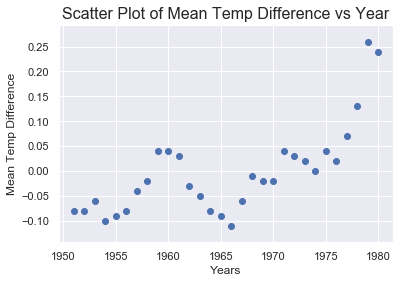
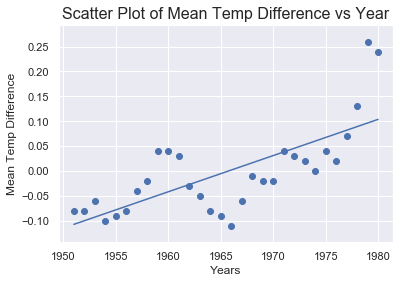
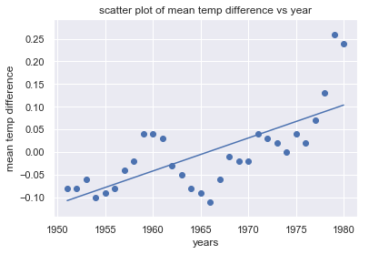
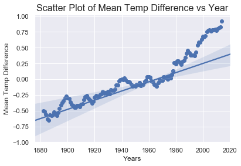

# Climate Change Analysis

A simple demo on how to use Python libraries — scikit-learn, NumPy, and Seaborn — to analyze climate data collected by NASA.

```python
import matplotlib.pyplot as plt
import numpy as np
from sklearn.linear_model import LinearRegression
import seaborn as sns; sns.set()
```

**Import the Data**


```python
yearsBase, meanBase = np.loadtxt('5-year-mean-1951-1980.csv', delimiter=',', usecols=(0, 1), unpack=True)
years, mean = np.loadtxt('5-year-mean-1882-2014.csv', delimiter=',', usecols=(0, 1), unpack=True)
```

**Create a scatter plot to visualize the data**


```python
plt.scatter(yearsBase, meanBase)
plt.title('Scatter Plot of Mean Temp Difference vs Year', fontsize=16)
plt.xlabel('Years', fontsize=12)
plt.ylabel('Mean Temp Difference', fontsize=12)
plt.show()
```





**1.Perform Linear Regression with Numpy**


```python
# Creates a linear regression from the data points
m,b = np.polyfit(yearsBase, meanBase, 1)

# This is a simple y = mx + b line function
def f(x):
    return m*x + b

# This generates the same scatter plot as before, but adds a line plot using the function above
plt.scatter(yearsBase, meanBase)
plt.plot(yearsBase, f(yearsBase))
plt.title('Scatter Plot of Mean Temp Difference vs Year', fontsize=16)
plt.xlabel('Years', fontsize=12)
plt.ylabel('Mean Temp Difference', fontsize=12)
plt.show()

# The computational work required to generate the regression line was done by NumPy's polyfit function,..
#...which computed the values of m and b in the equation y = mx + b.

# Prints text to the screen showing the computed values of m and b
print(' y = {0} * x + {1}'.format(m, b))
plt.show()
```





     y = 0.00727919911012223 * x + -14.30926585094524
    

**2.Perform Linear Regression with Scikit Learn**


```python
# Pick the Linear Regression model and instantiate it
model = LinearRegression(fit_intercept=True)

# Fit/build the model
model.fit(yearsBase[:, np.newaxis], meanBase)
mean_predicted = model.predict(yearsBase[:, np.newaxis])

# Generate a plot like the one in the previous exercise
plt.scatter(yearsBase, meanBase)
plt.plot(yearsBase, mean_predicted)
plt.title('Scatter Plot of Mean Temp Difference vs Year', fontsize=16)
plt.xlabel('Years', fontsize=12)
plt.ylabel('Mean Temp Difference', fontsize=12)
plt.show()

print(' y = {0} * x + {1}'.format(model.coef_[0], model.intercept_))
```





     y = 0.007279199110122357 * x + -14.309265850945492
    

**3.Perform Linear Regression with Seaborn**
Seaborn creates a regression line and a projection showing where data points should fall based on the regression.

```python
plt.scatter(years, mean)
plt.title('Scatter Plot of Mean Temp Difference vs Year', fontsize=16)
plt.xlabel('Years', fontsize=12)
plt.ylabel('Mean Temp Difference', fontsize=12)
sns.regplot(yearsBase, meanBase)
plt.show()
```





```python

```
 
### Reference
https://docs.microsoft.com/en-us/learn/modules/analyze-climate-data-with-azure-notebooks/
